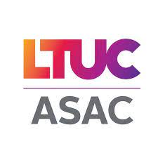

# Mahmoud Barghouthi
 
  Hello, My name is Mahmoud and I am 27 years old. I studied Spanish and English in Jordan university. Among that time, I Used to work with Students' Union in Media Team Sectionas a Video Editor for 3 Years.my goal in life is to gain knowledge and information about anything and improve myself in everything that I can as long as I breathe.

###### My basic skills in life is the following:
###### 1. Browsing and searching skills.
###### 2. Video editing.
###### 3. Installation of Windows. Dealing with computer and its software and hardware
###### 4. Basic information aboud Andriod Studio 
###### 5. Basic information about Photoshop

###### In the table below, you can see the topics that I have discussed and summarized during ASAC Internship:

  No. |  topics Title
  ------  |  ------
 read 01  | [Growth and Fixed Mindset](read01.md)
 read 02  | [Version Control with GIT](read02.md)
 read 03  | [HTML & CSS](read03.md)
 read 04a | [JavaScript and Jquery](read04a.md)
 read 04b | [How computers work](read04b.md)
 read 05  | [Comparison and logical operators](read05.md)

