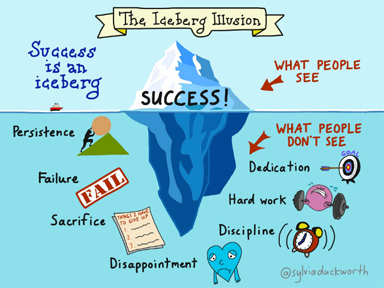

# Growth and Fixed Mindset
#### describse the underlying beliefs people have about learning and intelligence. When students believe they can get smarter, they understand that effort makes them stronger,Therefore they put in extra time and effort, and that leads to higher achievement. On the othre hand, the fixed mind describes people who see their qualities as fixed traits that cannot change. With a fixed mindset, talent is enough to lead to success and effort to improve these talents isn’t required: one is born with a certain amount of skill and intelligence that can’t be improved upon.

#### This pciture shows the difference between the fixed and growth minds:

#### what we can see from the picture is the follow:

### 1. Challenges

       - Growth: Facing the problems give you one step ahead by working and discovering the solution then you will have more experience as we saw in the example with our friend who works with Jira.
       - Fixed: Avoiding the challenge will let you stay in the bottom because you will always rely on the comfront zone not be able to discover yourself and make a progress as our friend.
  

### 2. Obstacles

       - Growth: Growth mind will try to find a way to jump over the obstacles to carry on their missions and persists
       - Fixed: it will cause to lose your focus on the main mission and get lost
 
 ### 3. Effort
 
 
       - Growth: No Pain No Gain is the same quote that I use to carry on to achieve my goals, I think it is one of the hardest thing to get because it requiresa huge effort and action.
       - Fixed: What is the exact opposite of effort is relief, relax nad being lazy and these will not develop any person to achieve his goals
       
  ### 4. Critisim
  
  
 
  
       - Growth: the best QOUTE for me here to describe it, WHAT DOES NOT KILL YOU, MAKES YOU STRONG.
       - Fixed: Just ignore and not taking advantage of it.
       
# Basic writing and formatting syntax
  #### There are many Syntax and symboles that we can use for writing and formatting
  1. Headings
      - with headings we can change the size of the text by using 1 # - 6 # Hashtag.
   
  2. Styling Text
      - to indicate emphasis with bold, italic, or strikethrough text.
      
  3. Qouting Text
      - You can quote text with a >.

#### to see more about Syntax of formatting and writing you can visit the link below
[GitHubDocs](https://docs.github.com/en/github/writing-on-github/basic-writing-and-formatting-syntax)

# Creating your Website with GitHub

To create your website please follow the following
1. Sign in and create your own repositry.
2. give this repository a special name to generate your website.
3. To begin setting up your site, you have to open the Settings tab.
4. scroll down on the settings page, you’ll see the GitHub Pages section near the bottom. Click the Choose a theme button to start the process of creating your site.
5. Once you’ve clicked the button, you’ll be directed to the Theme Chooser. You’ll see several theme options in a carousel across the top of the page. Click on the images to preview the themes. Once you’ve selected one, click Select theme on the right to move on. It’s easy to change your theme later, so if you’re not sure, just choose one for now.

6. write your own content (You can keep the default content for now, if you’d like).
7. Once you’re finished editing, scroll down to the bottom of the page and click Commit changes.

