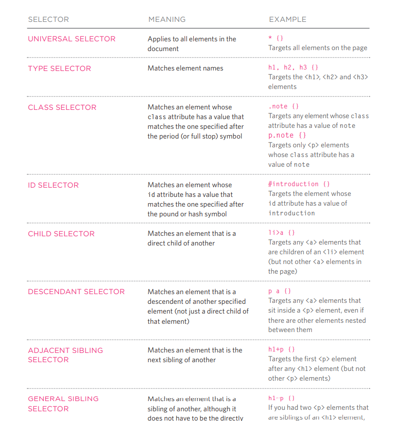

## Text
#### There are two types to add a markup to the text:
##### 1- Structural markup
##### To describe both headings and paragraphs
##### 2- Semantic Markup 
##### To provide extra informations such as where emphasisiid placed in a sentence.
-----
### Headings
#### HTML has six "levels" of headings:
Headings | Describtion
---- | ------
< h1 > | is used for main headings
< h2 > | is used for subheadings
------
### Paragraphs
##### TO create a pargraph, surround the words that make up the paragraph with an open and close tag.

#### < b > 
#### By enclosing words in the tags <b> and </b> we can make characters appear bold

#### < i > 
#### By enclosing words in the tags <i> and </i> we can make characters appear italic.

#### < sup >
#### The  element is used to contain characters that should be superscript such as the suffixes of dates or mathematical concepts

#### < sub >
#### The  element is used to contain characters that should be subscript. It is commonly used with foot notes or chemical formulas such as H20.

#### < br />
#### To start a sentence with a new line

#### < hr />
#### To create a break between to themes.
------
#### Visual editors
#### often resemble word processors. Although each editor will differ slightly, there are some features that are common to most editors that allow you to control the presentation of text.
------
#### Strong & Emphasis
##### they are being used to make the it bold or italic.
_______
### Quotations
#### < blockquote >
#### Is used for longer quotes that take up an entire paragraph
#### < q >
#### The <q> element is used for shorter quotes that sit within a paragraph
------
### Introduction to CSS

##### The key to understanding how CSS works is to imagine that there is aninvisiblebox around every HTML element.

##### CSS allows you to create rules that control the way that each individual box (andthe contents of that box) is presented

##### CSS Associates Style rules with HTML elements
-------
##### CSS works by associating rules with HTML elements. These rules govern how the content of specified elements should be displayed. A CSS rule contains two parts: a selector and a declaration.
----
##### CSS Properties Affect How Elements Are Displayed.

##### CSS declarations sit inside curly brackets and each is made up of two parts: a property and a value, separated by a colon. You can specify several properties in one declaration, each separated byasemi-colon.
-----

#### Using External CSS
CSS | Description
----| ----
link | The <link> element can be used in an HTML document to tell the browser where to find the CSS file used to style the page
href | This specifies the path to the CSS file (which is often placed in a folder called css or styles)
type | This attribute specifies the type of document being linked to. The value should be text/css
rel|This specifies the relationship between the HTML page and the file it is linked to. The value should be stylesheet when linking to a CSS file.
style | You can also include CSS rules within an HTML page by placing them inside a < style> element, which usually sits inside the <head> element of the page.
-------------------

#### The Picture below show you the selectors amd its meaining

--------------
### Basic JavaScript Instructions

#### What is script?
##### A script is a series of instructions that a computer can follow one-by-one. Each individual instruction or step is known as astatement. Statements should end with a semicolon. 
##### STATEMENTS ARE INSTRUCTIONS AND EACH ONE STARTS ON A NEW LINE

##### STATEMENTS ARE INSTRUCTIONS AND EACH ONE STARTS ON A NEW LINE

#### Comments 
##### STATEMENTS ARE INSTRUCTIONS AND EACH ONE STARTS ON A NEW LINE

#### MULTI-LINE COMM ENTS 
#### SINGLE-LINE COMMENTS 

#### Variables 
##### A script will have to temporarily store the bits of information it needs to do its job. It can store this data in variables.

#### To Declare a Variable, you need to write the following: Var variable name;

#### To assign a value into a variable, see the below:
#### quantity = 3;

### DATA TYPES 

Data Types | Description
---|---
NUMERIC | The numeric data type handles numbers. 
STRING | The strings data type consists of letters and other characters
BOOLEAN |The strings data type consists of letters and other characters
-----

### There are six rules for naming a variable
Number | Description
---- | -----
1|The strings data type consists of letters and other characters
2|The name can contain letters, numbers, dollar sign ($), or an underscore (_).
3|You cannot use keywords or reserved words. Keywords are special words that tell the interpreter to do something.
4|All variables are case sensitive, so score and Score would be different variable names
5|All variables are case sensitive,so score and Score would be different variable names
6|If your variable name is made up of more than one word, use a capital letter for the first letter of every word after the first word
-------------

### Arrays
#### what are the Arrays:
#### An array is a special type of variable. It doesn't just store one value; it stores a list of values.

### VALU ES IN ARRAYS 
#### Values in an array are accessed as if they are in a numbered list. It is important to know that the numbering of this list starts at zero (not one).

## Comparison Operators: 

### Evaluating Conditions

##### This command help us to evaluate a situation by comparing one value with a datatype to get the expected output. The result will be a boolean which is
##### * True
##### * False

##### Down below, we are going to see the symboles or a special characters that Java can read in order to interact with them:

Symbols | Meaning
-|-
Equal to (==) | Comapring two values (Numbers, strings and booleans) to see if they are the same.
Not equal to (!=) | to see if the two values are not the same (exact opposite of ==)
Strict Equal to (===) |compares two values to check both the datatype and value are the same
Stict not Equal (!==) | compares two values to check both the datatype and value are not the same
Greater than > | to check if the number on the left is greater than of the right.
Less than < | to check if the number on the left is less than of the right.
Greater than or Equal >= | to check if the number on the left is greater than or equal of the right
Less than or equal <= | to check if the number on the left is less than or equal of the right
_____________________________________________________________________________________________

### Logical Operators
##### Comparison Operators often return single values of T or F, Which allow the users to  compare the results more than one comparision Operator. Check the below image.

Now lets have a look of other logical Operators:

Logical Symbol | Meaning
-|-
&& | its (AND) Logical where this Operator test more than one Condition.(see the image below table for more example).
(or) | tests at lesat one Condition (see the image below table for more example).
! | takes a single boolean value and inverts it (see the image below table for more example).

_______________________________________________________________________________________________

