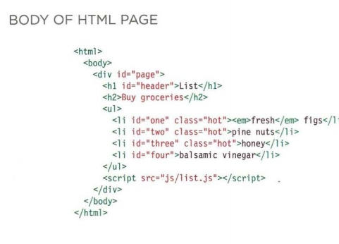

### What is an Object

#### Objects group together a set of variables and functions to create a model of a something you would recognize from the real world.In an object, variables and functions take on new names. 

#### Objects group together a set of variables and functions to create a model of a something you would recognize from the real world. In an object, variables and functions take on new names. 

#### An object for an hotel

Key | Value
--|--
Name | String
Rooms | Number
Booked | Number
gym|Boolean
RoomTypes |Array
---------
#### Programmers use a lot of name/value pairs: 
#### • HTML uses attribute names and values. 
#### • CSS uses property names and values. 
---------
### In JavaScript: 
#### • Variables have a name and you can assign them a value of a string, number, or Boolean. 
#### • Arrays have a name and a group of values. (Each item in an array is a name/value pair because it has an index number and a value.) 
#### • Named functions have a name and value that is a set of statements to run if the function is called. 
#### • Objects consist of a set of name/value pairs (but the names are referred to as keys)

-------------
### Document Object Model
#### it specifies how browsers should create a model of an HTML page and how JavaScript can access and update the contents of a web page while it is in the browser window.

#### The DOM specifies the way in which the browser should structure this model using a DOM tree. 

#### Application Programming Interface (API). User interfaces let humans interact with programs; APls let programs (and scripts) talk to each other. The DOM states what your script can "ask the browser about the current page, and how to tell the browser to update what is being shown to the user. 
----------------

### THE DOM TREE IS A MODEL OF A WEB PAGE(see the image below)

### WORKING WITH THE DOM TREE 

#### Accessing and updating the DOM tree involves two steps: 
#### 1: Locate the node that represents the element you want to work with. 
#### 2: Use its text content, child elements, and attributes.

#### DOM queries may return one element, or they may return a Nodelist, which is a collection of nodes. 

#### NODELISTS: DOM QUERIES THAT RETURN MORE THAN ONE ELEMENT

### When a DOM query returns a Nodelist, you may want to: 
### • Select one element from the NodeList. 
### • Loop through each item in the Nodelist and حerform thesame statements on each of the element nodes.

### Like any other object, a Nodelist has properties and methods, notably: 
#### • The l ength property tells you how many items are in the Nodelist. 
#### • The i tern() method returns a specific node from the Nodelist when you tell it the index number of the item that you want (in the parentheses). However, it is more common to use array syntax (with square_brackets) to retrieve an item from a Nodelist

--------------
