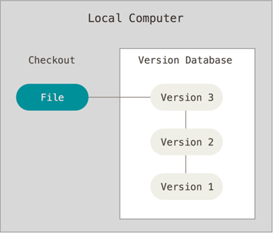
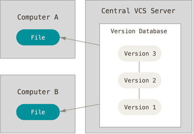
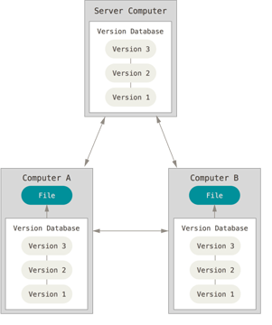

# Version Control

####  Version Control allows you to revert selected files back to a previous state, revert the entire project back to a previous state, compare changes over time, see who last modified something that might be causing a problem, who introduced an issue and when, and more. Using a VCS also generally means that if you screw things up or lose files, you can easily recover. In addition, you get all this for very little overhead.

#### Version control has many types such as the following:
 1. Local Version Control
 
 
    
    local version is to copy files into another directory (perhaps a time-stamped directory, if they’re clever). This approach is very common because it is so simple, but it is also incredibly error prone. It is easy to forget which directory you’re in and accidentally write to the wrong file or copy over files you don’t mean to.
  
 2. Centralized Version Control

The need for collaboration within a developer team on a single file or set of files led to the advent of the Centralized Version Control System (CVCS). These systems (such as CVS, Subversion, and Perforce) have a single server that contains all the versioned files, and a number of clients that check out files from that central place. For many years, this has been the standard for version control.

 3. Distributed Version Control
 
 

A Distributed Version Control systems (DVCS) addresses the major vulnerability of the CVS: the server as a single point of failure. If a CVS goes down, collaborators cannot work with each other on a file or save changes and new versions.

# WHAT IS GIT?!
Snapshots | Local Operations
------------ | -------------
Tracking Changes | Loss of Data and states

* Snapshots: Git is a DVCS that stores data in a file system made up of snapshots. Each time you save a changed version of your project.
* Local Operations: Git mostly relies on local operations because most necessary information can be found in local resources.
* Tracking Changes: Every single change applied to any file or directory is tracked by Git. And, as the gatekeeper, Git will always detect file corruption or loss of information in transit.
* Loss of Data: Git is set up to greatly minimize the possibility of irreversible damage to files, such as accidentally lost data. Git makes it extremely difficult for a snapshot of your file that is committed to be lost.
* States: Files in Git can reside in three main states:
   - Commited: All the data are secured and stored in a local database.
   - Modified: The file itself will be changed but not the database.
   - Staged: Flagged a file’s changed version to be committed in the next snapshot.

# History of GIT
  GIT has been established since of the opening source project Linux kernel. in 2002, DVC has been used by the developers and called Bitkeeper, but in 2005 many of the developers stopped using DVC due the tension among the linux kernel community and the company behind Bitkeeper's and the eventual revocation of the DVCS’ gratis status.By that, Linus Torvalds, the chief architect of the Linux kernel, began creating Git. With the intention of creating a DVCS with a workflow design similar to that of BitKeeper, which was also fast, Git allowed for non-linear development via multiple branches, could support large projects, possessed strong mechanisms preventing corruption, and had a simple design. Since its inception in 2005, Git has become one of the most utilized Version Control Systems in the world.

### Getting Started 
1. Download GIT
    - Install as a package
    - Install via another installer
    - Download and compile the source code.
3. Graphical Clients
4. Initial Customization
5. Default Text Editor
6. Check Settings
7. Getting Help

#### For more details about installing on Linux, MAC and Windows, Please follow the link Below:

###### [Getting Started](https://blog.udemy.com/git-tutorial-a-comprehensive-guide/)

### Setting up a Git Repository
Importing | Cloning
------------ | -------------

**To Import an existing Project, follow these steps:**
   - Switch to the target project’s directory
   - Use the git init command
   - To start tracking these repository files, perform an initial commit by typing the following:
   
          * $ git add *.c
          * $ git add LICENSE
          * $ git commit -m “any message here”
             
*Now, your files are tracked and there’s an initial commit. We will discuss the particular commands in detail soon.*

**Cloning**

You can also create a copy of an existing Git repository from a particular server by using the clone command with a repository’s URL:

$ git clone https://github.com/test
By cloning the file, you have copied all versions of all files for a project. This command leads to the creation of a directory called “test,” with an initialized .git directory inside it, which has copies of all versions of all files for the specified project. The command also automatically checks out — or retrieves for editing — a copy of the newest version of the project.

To clone a repository into a directory with another name of your choosing, use the following command format:

$ git clone https://github.com/test mydirectory
The command above makes a copy of the target repository in a directory named “mydirectory.”
 
### The Life Cycle of File Status
     1. After you edit a file, Git flags it as modified because of changes made after the previous commit.
     2. You stage the modified file.
     3. Then, you commit staged changes.
