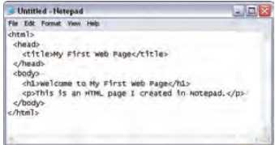
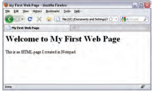
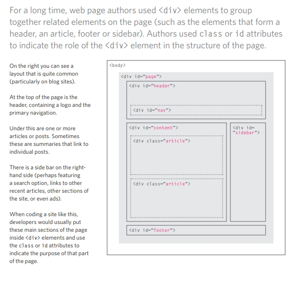
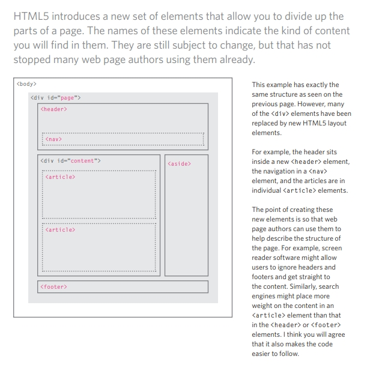

# HTML & CSS

## Structure 

### What is Structure

#### Structure is structure is very important in helping readers to understand the messages you are trying to convey and to navigate around the document, so in order to learn how to write a webpage, we need to understand how to strcuture document, it is very important 

### How Pages Work

Pages has different type of structure to be written, but most of it has the sme in common. Web pages or paper pages are sharing the same structure when it comes to work, where you can see images, headlines, subheadings and etc, but for the webpage you can add more like Audio or GIF or even some videos to clear the idea.
sa
### Structuring Word Documents
In word Documents, we can use large heading followed by an importants notes and information can help the reader to understand more. we can devide our topics to parahraph or we can make different headings to describe what it covers

### HTML Describes the Structure of Pages
When it comes to webpages, we use some codes in order to interact, design and add text to have the latest output. 

### HTML Uses Elements to Describe the Structure of Pages
* Codes
* Tags
* Attributes 
* Body Head and Tittle

### Creating a webpage on PC/Windows
To start Create a webpage on PC, follow these steps
1. Click Start > Prpgrams > accessories > Notepad or Right Click with your mouse > New > Notepad.
2. write the code as in the picture below

3.Save as the file as first-test-html.

4. Start your web browser. Go to the File menu and select Open. Browse to the file that you just created, select it and click on the Open button. The result should look something like the screen shot below.

5. Yalaaa, your first webpage. Congrats

## Extra Markup (Chapter 8)

### The Evolution of HTML
Each new version was designed to be an improvement on the last (with new elements and attributes added and older code (removed)

1. HTML 4
With the exception of a few elements added in HTML5 , the elements you have seen in this book were all available in HTML 4. 

2. XHTML 1.0
In 1998, a language called XML was published. Its purpose was to allow people to write new markup languages. Since HTML was the most widely used markup language around, it was decided that HTML 4 should be reformulated to follow the rules of XML and it was renamed 
XHTML. This meant that authors had to follow some new, more strict rules about writing markup. For example:

* Every element needed a closing tag (except for empty elements such as ).
* Attribute names had to be in lowercase.
* All attributes required a value,and all values were to be placed in double quotes.
* Deprecated elements should no longer be used.
* Every element that was opened inside another element should be closed inside that same element.

3. HTML5

In HTML5, web page authors do not need to close all tags, and new elements and attributes will be introduced

### DOCTYPE

Because there have been several versions of HTML, each web page should begin with a DOCTYPE declaration to tell a browser which version of HTML the page is using (although browsers usually display the page even if it is not included). We will therefore be including one in each example for the rest of the book

### Comments in HTML

If you want to add a comment to your code that will not be visible in the user's browser, you can add the text between these characters:
<!-- comment goes here -->

### ID Attribute

Every HTML element can carry the id attribute. It is used to uniquely identify that element from other elements on the page. Its value should start with a letter or an underscore (not a number or any other character).It is important that no two elements on the same page have the same value for their idattributes

### Class Attribute

Every HTML element can also carry a class attribute. Sometimes, rather than uniquely identifying one element within a document, you will want a way to identify several elements as being different from the other elements on the page. 

### Block Elements
Some elements will always appear to start on a new line in the browser window. These are known as block level elements.

## HTML5 Layout (Chapter 17)

HTML5 is introducing a new set of elements that help define the structure of a page.

### Traditional HTML Layouts
to have more information about Traditional HTML Layouts, See the image below

### New Html5 LayoutElements

to have more information about Traditional HTML Layouts, See the image below

### Headers & Footers

The <header> and <footer>elements can be used for:
* The main header or footer that appears at the top or bottom of every page on the site.
* A header or footer for an individual <article> or <section> within the page.

### Navigation

The <nav> element is used to contain the major navigational blocks on the site such as the 
primary site navigation.

### Articles

The <article> element acts as a container for any section of a page that could stand alone and potentially be syndicated.

### Sections
The <section> element groups related content together, and typically each section would have its own heading

### Heading Groups
The purpose of the <hgroup>element is to group together a set of one or more <h1> through <h6> elements so that they are treated as one single heading

### Figures
You already met the <figure>element in Chapter 5 when we looked at images. It can be used to contain any content that is referenced from the main flow of an article (not just images)

### Sectioning Elements

It may seem strange to follow these new elements by revisiting the 
 element again. (After all, the new elements are often going to be used in its place.)
However, the 
 element will remain an important way to group together related elements because you should not be using these new elements that you have just met for purposes other than those explicitly stated. 

### Linking Around Block-Level Elements

HTML5 allows web page authors to place an <a> element around a block level element that contains child elements. This allows you to turn an entire block into a link.This is not a new element in HTML5, but it was not seen as a correct usage of the <a> element 
in earlier versions of HTML.

### Helping Older Browsers Understand

Older browsers that do not know the new HTML5 elements will automatically treat them as inline elements. Therefore, to help older browsers, you should include the line of CSS on the left which states which new elements should be rendered as block-level elements.

