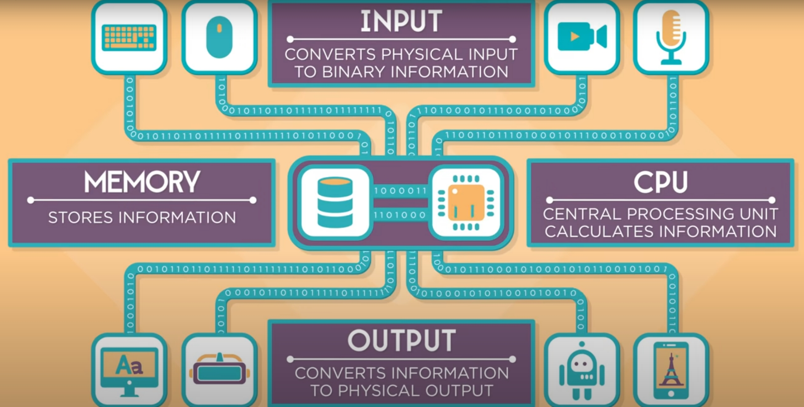

### How Computer Works (Intro with Bill)

##### Many question have been asked about how Computers Work, with Code.org, we going have the answer about the following

###### 1. What Makes a Computer, a Computer?
###### 2. Binary & Data
###### 3. Circuits and Logic.
###### 4. CPU, Memory, Input & Output.
###### 5. Hardware and Software

### What makes a computer a computer ( May-Li Khoe & Nat)

###### Tools can help us to solve any problem, we used to use hammer or any other tools. But with the computers it's different

###### Computers were made by wood and metal at the first time of its creation, later then it was made by Electrical Components. Also it started to as a base calculator, only dealing with numbers. But nowadays, we can everything. 

###### To Design a thinking machine, the pioneer of computer science explored the following four Tasks

###### Take Input
###### Store information
###### process it 
###### Output of the Input

###### Input means where we can talk to our computers using Mouse, Keyboard, Cameras, Microphone or even sending signals to the computers.

###### Storing and processing actually it is a combine job, they stick together. First, we store all the data that comes from the input and then it starts to process it,  by using the algorathim which is a series of commands, then it send back to memory.

###### Output is the final stage where we can see the results on our screens.

### Binary & Data (Limor Fried & Federico)

###### Ones and Zeros do play a huge role in how computers work on the inside, even though that almost nobody actually deals with them directly

###### All the information in the computers are carried with electric wires and circuits.

###### One wire can represent Ones and Zeros, True or False or on or off and it is called a bit.

###### bit is the smallest piece of informationa computer can store

###### In the Binary, each position carry a value times 2.

###### Text, Images and sounds can be presented by numbers

###### Images are made out of teeny dots called Pixels, each pixels has a color that can be represented by numbers.

### Circuits and Logic (Limor Fried & Nat)

###### Every Input or output is effectively a type of information can be presented by electrical signals.

###### The Signal that goes in is not the same as the singal that comes out and so, we call this circut not

###### Complicated Circuits take Multiple Signals

###### Using the logical Gates And / Or.

### CPU, Memory, Input & Output (Madison Maxey & Danielle)

###### How the inptus travel through computers

###### Pressing a key on the keyboard converts the letter to a number.
###### Starting from there, the CPU Calculates how to display letter B, Pixels by Pixel.

###### The memory will send a step  by step a drawing to know how to draw the letter B.

###### CPU runs these instruction and store them as a pixels in memory.

###### Finally, it will be sent to our displays

### Hardware and Software (Erica Gomez & Jerome)

###### Hardware are the things that we can see and touch inside the computers, like RAM, Graphic Card, keyboard, CPU and etc..

###### Software are things that can not be seen or touched, like programs or codes that running on the machines.
