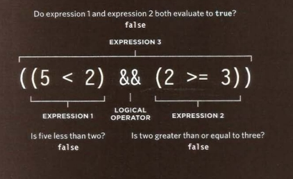
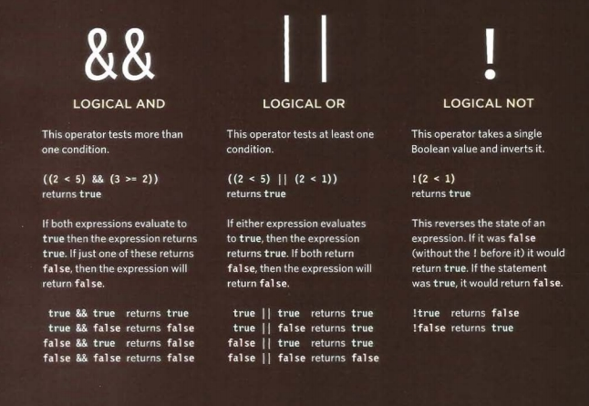
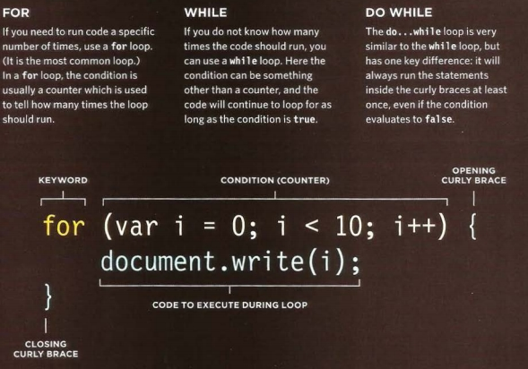
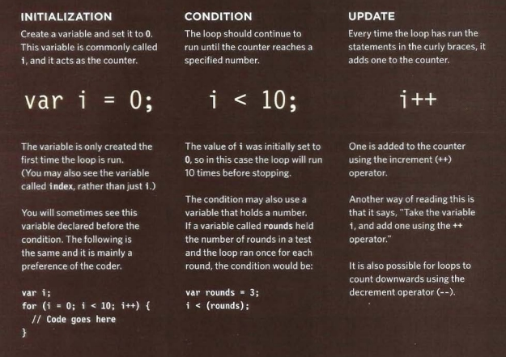

## Comparison Operators: 
###### (155,151, 156, 157) Java and Jquary

### Evaluating Conditions

##### This command help us to evaluate a situation by comparing one value with a datatype to get the expected output. The result will be a boolean which is
##### * True
##### * False

##### Down below, we are going to see the symboles or a special characters that Java can read in order to interact with them:

Symbols | Meaning
-|-
Equal to (==) | Comapring two values (Numbers, strings and booleans) to see if they are the same.
Not equal to (!=) | to see if the two values are not the same (exact opposite of ==)
Strict Equal to (===) |compares two values to check both the datatype and value are the same
Stict not Equal (!==) | compares two values to check both the datatype and value are not the same
Greater than > | to check if the number on the left is greater than of the right.
Less than < | to check if the number on the left is less than of the right.
Greater than or Equal >= | to check if the number on the left is greater than or equal of the right
Less than or equal <= | to check if the number on the left is less than or equal of the right
_____________________________________________________________________________________________

### Logical Operators
##### Comparison Operators often return single values of T or F, Which allow the users to  compare the results more than one comparision Operator. Check the below image.

Now lets have a look of other logical Operators:

Logical Symbol | Meaning
-|-
&& | its (AND) Logical where this Operator test more than one Condition.(see the image below table for more example).
(or) | tests at lesat one Condition (see the image below table for more example).
! | takes a single boolean value and inverts it (see the image below table for more example).

_______________________________________________________________________________________________

## Comparison Operators:
###### (170, 173, 176) Java and Jquary

### Loops
#### to check a Condition. if it returns true, a code will block run. Then the Condition will be checked again and if it still returns true. (Check the Two images below)

