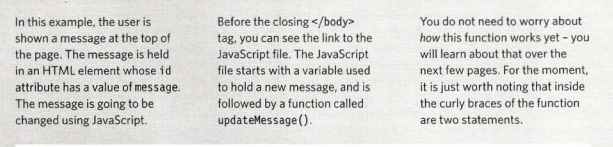
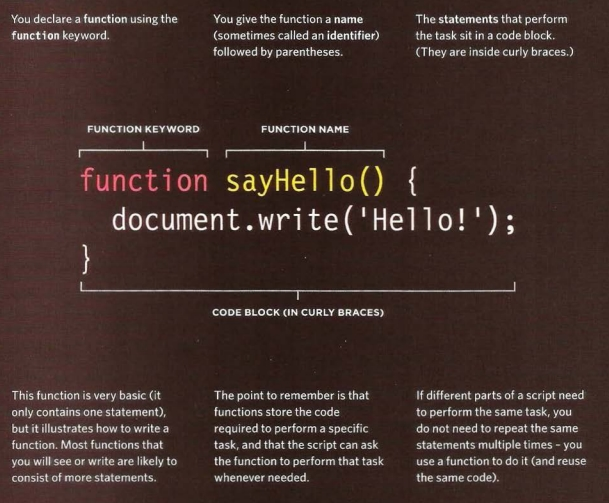
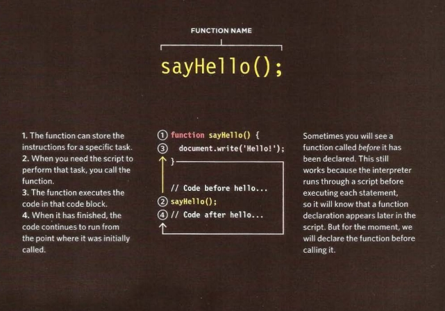
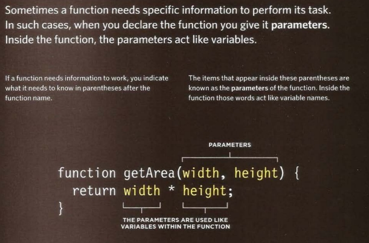
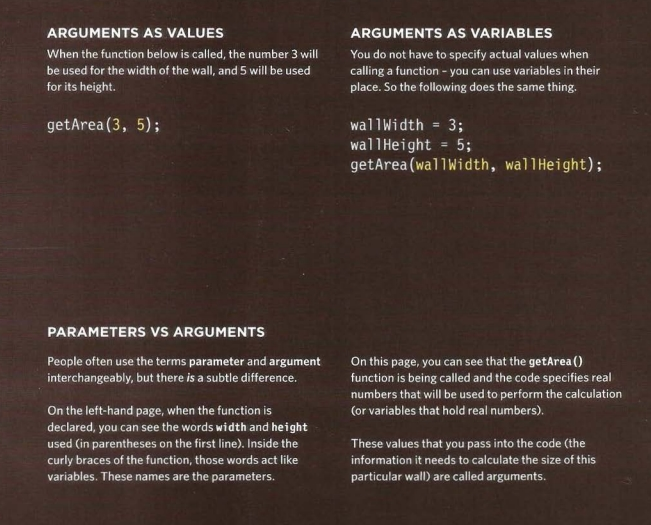

### WHAT IS A FUNCTION? 
##### Functions let you group a series of statements together to perform a specific task.

#### Calling Function
##### If you are going to ask the Pieces of information passed name,those statements will run. function to perform its task to a function are known as later, you need to give your parameters. You can also have anonymous function a name. That name functions. They do not have a should describe the task it is When you write a function and name, so they cannotbecalled. performing. When you ask it to you expect it to provide you Instead, they are executed as perform its task.

#### Parameters
##### Some function need to be provided with information in order to achieve a given task.

#### Return Value
##### When you write a function and you expect it to provide you with an answer.

#### A BASIC FUNCTION 
##### kindly see the below image to read more about the basic. 

#### How to declare a function
##### To create a function, you give it a name and then write the statements needed to achieve its task inside the curly braces.
-----
##### See the image below for more information

#### Calling a function
###### Having declared the function, you can then execute all of the statements between its curly braces with just one line of code.
###### see the below image for more information 

----
#### Declaring functions that need information

##### Sometimes a function needs specific information to perform its task.

##### see the image below.

##### Calling function that need information

##### When you call a function that has parameters, you sepcify the calues it should use in the paranthese that follow its name.
##### see the below image for more information

