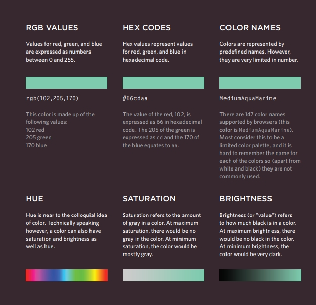

### Understanding CSS
#### Think inside the BOX

##### 1. there is an invisible box around every HTML element.
##### 2. CSS allows you to create rules that control the way that each individual box.
##### 3. CSS Associates Style rules with HTML elements.
##### 4. CSS Properties Affect How Elements Are Displayed.
---

#### Colors

#### what is Foreground Color for CSS
##### The color property allows you to specify the color of text inside an element. You can specify any color in CSS in one of three ways:
##### 1. Red-Green-Blue (RGB) values.
##### 2. HEX Codes.
##### 3. Color Names.
---

---

#### what is Background Color for CSS
##### CSS treats each HTML element as if it appears in a box, and the background-color property sets the color of the background for that box.

##### You can specify your choice of background color in the same three ways you can specify foreground colors: RGB values, HEX and Color Names.

See the Picture below to know more about colors:

